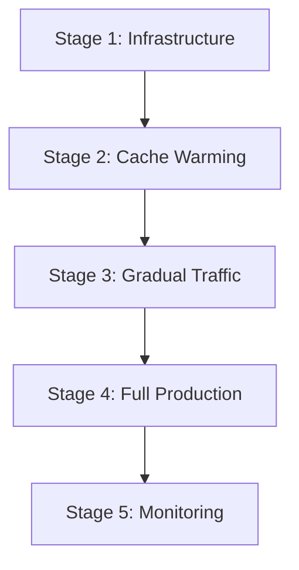

# Redis Cache Warming and Deployment Strategy for FitnessMealPlanner

## 🔥 Cache Warming Overview

Cache warming is the process of pre-populating Redis cache with frequently accessed data before production traffic hits the system, ensuring optimal performance from the moment the application goes live.

## 🎯 Cache Warming Strategy

### 1. Phased Deployment Approach



#### Stage 1: Infrastructure Deployment
- Deploy Redis infrastructure
- Configure monitoring and alerting
- Verify security settings
- Run health checks

#### Stage 2: Cache Warming
- Pre-populate critical data
- Load user sessions from backup
- Cache popular recipes and meal plans
- Warm search result cache

#### Stage 3: Gradual Traffic Shift
- Route 10% of traffic to new Redis
- Monitor performance metrics
- Gradually increase to 50%, 75%, 100%

#### Stage 4: Full Production
- Complete traffic migration
- Disable old cache (if applicable)
- Full monitoring active

#### Stage 5: Ongoing Monitoring
- Performance optimization
- Cache efficiency analysis
- Capacity planning

## 🚀 Cache Warming Implementation

### 1. Pre-Deployment Cache Warming Script

```bash
#!/bin/bash
# redis-cache-warmer.sh
# Pre-populate Redis cache with essential data

set -euo pipefail

# Configuration
REDIS_HOST="${REDIS_HOST:-redis-primary}"
REDIS_PORT="${REDIS_PORT:-6379}"
REDIS_PASSWORD="${REDIS_PASSWORD}"
DATABASE_URL="${DATABASE_URL}"
LOG_FILE="/var/log/redis/cache-warming-$(date +%Y%m%d_%H%M%S).log"

# Colors for output
GREEN='\033[0;32m'
BLUE='\033[0;34m'
YELLOW='\033[1;33m'
NC='\033[0m'

log() {
    echo -e "${BLUE}[$(date +'%Y-%m-%d %H:%M:%S')]${NC} $1" | tee -a "$LOG_FILE"
}

success() {
    echo -e "${GREEN}✅${NC} $1" | tee -a "$LOG_FILE"
}

warn() {
    echo -e "${YELLOW}⚠️${NC} $1" | tee -a "$LOG_FILE"
}

# Test Redis connectivity
test_redis_connection() {
    log "Testing Redis connection..."
    
    if redis-cli -h "$REDIS_HOST" -p "$REDIS_PORT" -a "$REDIS_PASSWORD" ping > /dev/null; then
        success "Redis connection successful"
        return 0
    else
        echo "❌ Cannot connect to Redis" | tee -a "$LOG_FILE"
        return 1
    fi
}

# Warm popular recipes cache
warm_popular_recipes() {
    log "Warming popular recipes cache..."
    
    # Get popular recipes from database
    psql "$DATABASE_URL" -t -c "
        SELECT r.id, r.name, r.ingredients, r.instructions, r.calories, r.prep_time, r.cook_time
        FROM recipes r
        ORDER BY r.view_count DESC, r.rating DESC
        LIMIT 100;
    " | while IFS='|' read -r id name ingredients instructions calories prep_time cook_time; do
        
        if [[ -n "$id" ]] && [[ "$id" != " " ]]; then
            recipe_json=$(jq -n \
                --arg id "$(echo $id | xargs)" \
                --arg name "$(echo $name | xargs)" \
                --arg ingredients "$(echo $ingredients | xargs)" \
                --arg instructions "$(echo $instructions | xargs)" \
                --arg calories "$(echo $calories | xargs)" \
                --arg prep_time "$(echo $prep_time | xargs)" \
                --arg cook_time "$(echo $cook_time | xargs)" \
                '{
                    id: $id,
                    name: $name,
                    ingredients: ($ingredients | split(",")),
                    instructions: $instructions,
                    calories: ($calories | tonumber),
                    prepTime: ($prep_time | tonumber),
                    cookTime: ($cook_time | tonumber),
                    cached: true,
                    cacheTime: (now | todate)
                }'
            )
            
            # Cache recipe with popularity-based TTL
            local ttl=14400  # 4 hours base
            redis-cli -h "$REDIS_HOST" -p "$REDIS_PORT" -a "$REDIS_PASSWORD" \
                setex "recipe:$(echo $id | xargs)" "$ttl" "$recipe_json" > /dev/null
        fi
    done
    
    local cached_count
    cached_count=$(redis-cli -h "$REDIS_HOST" -p "$REDIS_PORT" -a "$REDIS_PASSWORD" \
        eval "return #redis.call('keys', 'recipe:*')" 0)
    
    success "Cached $cached_count popular recipes"
}

# Warm user meal plans cache
warm_user_meal_plans() {
    log "Warming user meal plans cache..."
    
    # Get recent active meal plans
    psql "$DATABASE_URL" -t -c "
        SELECT mp.user_id, mp.id, mp.name, mp.meals, mp.created_at
        FROM meal_plans mp
        JOIN users u ON mp.user_id = u.id
        WHERE mp.created_at >= NOW() - INTERVAL '7 days'
        AND u.last_login >= NOW() - INTERVAL '3 days'
        ORDER BY mp.created_at DESC
        LIMIT 500;
    " | while IFS='|' read -r user_id plan_id name meals created_at; do
        
        if [[ -n "$user_id" ]] && [[ "$user_id" != " " ]]; then
            meal_plan_json=$(jq -n \
                --arg user_id "$(echo $user_id | xargs)" \
                --arg plan_id "$(echo $plan_id | xargs)" \
                --arg name "$(echo $name | xargs)" \
                --arg meals "$(echo $meals | xargs)" \
                --arg created_at "$(echo $created_at | xargs)" \
                '{
                    userId: $user_id,
                    id: $plan_id,
                    name: $name,
                    meals: ($meals | fromjson? // []),
                    createdAt: $created_at,
                    cached: true
                }'
            )
            
            # Cache meal plan with 24 hour TTL
            redis-cli -h "$REDIS_HOST" -p "$REDIS_PORT" -a "$REDIS_PASSWORD" \
                setex "mealplan:$(echo $user_id | xargs):$(echo $plan_id | xargs)" 86400 "$meal_plan_json" > /dev/null
        fi
    done
    
    local cached_count
    cached_count=$(redis-cli -h "$REDIS_HOST" -p "$REDIS_PORT" -a "$REDIS_PASSWORD" \
        eval "return #redis.call('keys', 'mealplan:*')" 0)
    
    success "Cached $cached_count meal plans"
}

# Warm user preferences cache
warm_user_preferences() {
    log "Warming user preferences cache..."
    
    # Get active user preferences
    psql "$DATABASE_URL" -t -c "
        SELECT u.id, u.dietary_preferences, u.allergies, u.fitness_goals
        FROM users u
        WHERE u.last_login >= NOW() - INTERVAL '7 days'
        ORDER BY u.last_login DESC
        LIMIT 1000;
    " | while IFS='|' read -r user_id preferences allergies goals; do
        
        if [[ -n "$user_id" ]] && [[ "$user_id" != " " ]]; then
            preferences_json=$(jq -n \
                --arg user_id "$(echo $user_id | xargs)" \
                --arg preferences "$(echo $preferences | xargs)" \
                --arg allergies "$(echo $allergies | xargs)" \
                --arg goals "$(echo $goals | xargs)" \
                '{
                    userId: $user_id,
                    dietaryPreferences: ($preferences | split(",") // []),
                    allergies: ($allergies | split(",") // []),
                    fitnessGoals: ($goals | split(",") // []),
                    cached: true
                }'
            )
            
            # Cache preferences with 7 day TTL
            redis-cli -h "$REDIS_HOST" -p "$REDIS_PORT" -a "$REDIS_PASSWORD" \
                setex "preferences:$(echo $user_id | xargs)" 604800 "$preferences_json" > /dev/null
        fi
    done
    
    local cached_count
    cached_count=$(redis-cli -h "$REDIS_HOST" -p "$REDIS_PORT" -a "$REDIS_PASSWORD" \
        eval "return #redis.call('keys', 'preferences:*')" 0)
    
    success "Cached $cached_count user preferences"
}

# Warm search results cache
warm_search_cache() {
    log "Warming search results cache..."
    
    # Common search terms for FitnessMealPlanner
    local search_terms=(
        "chicken breast"
        "vegetarian"
        "low carb"
        "high protein"
        "gluten free"
        "quick meals"
        "breakfast"
        "dinner"
        "weight loss"
        "muscle gain"
        "keto"
        "mediterranean"
        "salad"
        "soup"
        "pasta"
    )
    
    for term in "${search_terms[@]}"; do
        # Create search hash
        local search_hash
        search_hash=$(echo -n "$term" | md5sum | cut -d' ' -f1)
        
        # Get search results from database
        local search_results
        search_results=$(psql "$DATABASE_URL" -t -c "
            SELECT json_agg(
                json_build_object(
                    'id', r.id,
                    'name', r.name,
                    'calories', r.calories,
                    'rating', r.rating
                )
            )
            FROM recipes r
            WHERE r.name ILIKE '%$term%' 
            OR r.ingredients ILIKE '%$term%'
            ORDER BY r.rating DESC, r.view_count DESC
            LIMIT 20;
        ")
        
        if [[ -n "$search_results" ]] && [[ "$search_results" != " " ]]; then
            # Cache search results with 30 minute TTL
            redis-cli -h "$REDIS_HOST" -p "$REDIS_PORT" -a "$REDIS_PASSWORD" \
                setex "search:$search_hash" 1800 "$search_results" > /dev/null
        fi
    done
    
    local cached_count
    cached_count=$(redis-cli -h "$REDIS_HOST" -p "$REDIS_PORT" -a "$REDIS_PASSWORD" \
        eval "return #redis.call('keys', 'search:*')" 0)
    
    success "Cached $cached_count search results"
}

# Warm nutrition data cache
warm_nutrition_cache() {
    log "Warming nutrition data cache..."
    
    # Common ingredients and their nutrition data
    psql "$DATABASE_URL" -t -c "
        SELECT ingredient_name, calories_per_100g, protein, carbs, fat, fiber
        FROM nutrition_data
        ORDER BY usage_frequency DESC
        LIMIT 200;
    " | while IFS='|' read -r ingredient calories protein carbs fat fiber; do
        
        if [[ -n "$ingredient" ]] && [[ "$ingredient" != " " ]]; then
            nutrition_json=$(jq -n \
                --arg ingredient "$(echo $ingredient | xargs)" \
                --arg calories "$(echo $calories | xargs)" \
                --arg protein "$(echo $protein | xargs)" \
                --arg carbs "$(echo $carbs | xargs)" \
                --arg fat "$(echo $fat | xargs)" \
                --arg fiber "$(echo $fiber | xargs)" \
                '{
                    ingredient: $ingredient,
                    caloriesPer100g: ($calories | tonumber),
                    protein: ($protein | tonumber),
                    carbs: ($carbs | tonumber),
                    fat: ($fat | tonumber),
                    fiber: ($fiber | tonumber),
                    cached: true
                }'
            )
            
            # Cache nutrition data with 24 hour TTL
            local ingredient_key
            ingredient_key=$(echo "$ingredient" | xargs | tr '[:upper:]' '[:lower:]' | sed 's/ /_/g')
            redis-cli -h "$REDIS_HOST" -p "$REDIS_PORT" -a "$REDIS_PASSWORD" \
                setex "nutrition:$ingredient_key" 86400 "$nutrition_json" > /dev/null
        fi
    done
    
    local cached_count
    cached_count=$(redis-cli -h "$REDIS_HOST" -p "$REDIS_PORT" -a "$REDIS_PASSWORD" \
        eval "return #redis.call('keys', 'nutrition:*')" 0)
    
    success "Cached $cached_count nutrition entries"
}

# Generate cache statistics
generate_cache_stats() {
    log "Generating cache statistics..."
    
    local stats_json
    stats_json=$(redis-cli -h "$REDIS_HOST" -p "$REDIS_PORT" -a "$REDIS_PASSWORD" INFO memory | 
        grep -E "(used_memory|used_memory_human|mem_fragmentation_ratio)" | 
        while IFS=':' read -r key value; do
            echo "\"$key\": \"$(echo $value | tr -d '\r')\","
        done | sed '$s/,$//')
    
    local total_keys
    total_keys=$(redis-cli -h "$REDIS_HOST" -p "$REDIS_PORT" -a "$REDIS_PASSWORD" DBSIZE)
    
    cat > "/tmp/cache-warming-stats.json" << EOF
{
    "timestamp": "$(date -Iseconds)",
    "totalKeys": $total_keys,
    "memory": {
        $stats_json
    },
    "keysByType": {
        "recipes": $(redis-cli -h "$REDIS_HOST" -p "$REDIS_PORT" -a "$REDIS_PASSWORD" eval "return #redis.call('keys', 'recipe:*')" 0),
        "mealplans": $(redis-cli -h "$REDIS_HOST" -p "$REDIS_PORT" -a "$REDIS_PASSWORD" eval "return #redis.call('keys', 'mealplan:*')" 0),
        "preferences": $(redis-cli -h "$REDIS_HOST" -p "$REDIS_PORT" -a "$REDIS_PASSWORD" eval "return #redis.call('keys', 'preferences:*')" 0),
        "searches": $(redis-cli -h "$REDIS_HOST" -p "$REDIS_PORT" -a "$REDIS_PASSWORD" eval "return #redis.call('keys', 'search:*')" 0),
        "nutrition": $(redis-cli -h "$REDIS_HOST" -p "$REDIS_PORT" -a "$REDIS_PASSWORD" eval "return #redis.call('keys', 'nutrition:*')" 0)
    }
}
EOF
    
    success "Cache warming statistics saved to /tmp/cache-warming-stats.json"
    cat "/tmp/cache-warming-stats.json"
}

# Main cache warming execution
main() {
    log "Starting Redis cache warming for FitnessMealPlanner"
    log "=================================================="
    
    if ! test_redis_connection; then
        echo "❌ Cache warming aborted - Redis connection failed"
        exit 1
    fi
    
    # Check if required tools are available
    for tool in psql jq redis-cli; do
        if ! command -v $tool &> /dev/null; then
            echo "❌ Required tool '$tool' is not installed"
            exit 1
        fi
    done
    
    local start_time
    start_time=$(date +%s)
    
    # Execute cache warming steps
    warm_popular_recipes
    warm_user_meal_plans
    warm_user_preferences
    warm_search_cache
    warm_nutrition_cache
    
    local end_time
    end_time=$(date +%s)
    local duration=$((end_time - start_time))
    
    generate_cache_stats
    
    success "Cache warming completed in ${duration} seconds"
    log "Cache warming log: $LOG_FILE"
}

# Run cache warming if executed directly
if [[ "${BASH_SOURCE[0]}" == "${0}" ]]; then
    main "$@"
fi
```

### 2. Application-Level Cache Warming

```javascript
// cache-warming-service.js
// Application-level cache warming for FitnessMealPlanner

const redis = require('redis');
const { Pool } = require('pg');

class CacheWarmingService {
  constructor(redisConfig, dbConfig) {
    this.redis = redis.createClient(redisConfig);
    this.db = new Pool(dbConfig);
    this.isWarming = false;
  }

  async warmCache(options = {}) {
    if (this.isWarming) {
      console.log('Cache warming already in progress');
      return;
    }

    this.isWarming = true;
    const startTime = Date.now();

    try {
      console.log('Starting application-level cache warming...');

      // Warm different cache layers in parallel
      await Promise.all([
        this.warmPopularRecipes(options.recipeCount || 100),
        this.warmActiveUserSessions(options.sessionCount || 500),
        this.warmFrequentSearches(options.searchCount || 20),
        this.warmNutritionData(options.nutritionCount || 200)
      ]);

      const duration = Date.now() - startTime;
      console.log(`Cache warming completed in ${duration}ms`);
      
      return await this.getCacheStatistics();

    } catch (error) {
      console.error('Cache warming failed:', error);
      throw error;
    } finally {
      this.isWarming = false;
    }
  }

  async warmPopularRecipes(count = 100) {
    console.log(`Warming ${count} popular recipes...`);

    const query = `
      SELECT r.id, r.name, r.ingredients, r.instructions, 
             r.calories, r.prep_time, r.cook_time, r.rating, r.view_count
      FROM recipes r
      WHERE r.is_active = true
      ORDER BY r.view_count DESC, r.rating DESC
      LIMIT $1
    `;

    const result = await this.db.query(query, [count]);
    const pipeline = this.redis.pipeline();

    for (const recipe of result.rows) {
      const cacheKey = `recipe:${recipe.id}`;
      const ttl = this.calculateRecipeTTL(recipe);
      
      pipeline.setex(cacheKey, ttl, JSON.stringify({
        ...recipe,
        cached: true,
        cacheTime: new Date().toISOString()
      }));
    }

    await pipeline.exec();
    console.log(`✅ Warmed ${result.rows.length} recipes`);
  }

  async warmActiveUserSessions(count = 500) {
    console.log(`Warming ${count} active user sessions...`);

    const query = `
      SELECT u.id, u.email, u.dietary_preferences, u.allergies, 
             u.fitness_goals, u.last_login
      FROM users u
      WHERE u.last_login >= NOW() - INTERVAL '3 days'
      ORDER BY u.last_login DESC
      LIMIT $1
    `;

    const result = await this.db.query(query, [count]);
    const pipeline = this.redis.pipeline();

    for (const user of result.rows) {
      const sessionKey = `preferences:${user.id}`;
      const sessionData = {
        userId: user.id,
        dietaryPreferences: user.dietary_preferences || [],
        allergies: user.allergies || [],
        fitnessGoals: user.fitness_goals || [],
        lastLogin: user.last_login,
        cached: true
      };

      pipeline.setex(sessionKey, 604800, JSON.stringify(sessionData)); // 7 days
    }

    await pipeline.exec();
    console.log(`✅ Warmed ${result.rows.length} user sessions`);
  }

  async warmFrequentSearches(count = 20) {
    console.log(`Warming ${count} frequent searches...`);

    // Get popular search terms from search logs
    const query = `
      SELECT search_term, COUNT(*) as frequency
      FROM search_logs
      WHERE created_at >= NOW() - INTERVAL '7 days'
      GROUP BY search_term
      ORDER BY frequency DESC
      LIMIT $1
    `;

    const result = await this.db.query(query, [count]);
    const pipeline = this.redis.pipeline();

    for (const search of result.rows) {
      const searchResults = await this.performSearch(search.search_term);
      const searchHash = this.createSearchHash(search.search_term);
      const cacheKey = `search:${searchHash}`;

      pipeline.setex(cacheKey, 1800, JSON.stringify({ // 30 minutes
        term: search.search_term,
        results: searchResults,
        cached: true,
        cacheTime: new Date().toISOString()
      }));
    }

    await pipeline.exec();
    console.log(`✅ Warmed ${result.rows.length} search results`);
  }

  async warmNutritionData(count = 200) {
    console.log(`Warming ${count} nutrition entries...`);

    const query = `
      SELECT ingredient_name, calories_per_100g, protein, carbs, fat, fiber
      FROM nutrition_data
      ORDER BY usage_frequency DESC
      LIMIT $1
    `;

    const result = await this.db.query(query, [count]);
    const pipeline = this.redis.pipeline();

    for (const nutrition of result.rows) {
      const cacheKey = `nutrition:${nutrition.ingredient_name.toLowerCase().replace(/\s+/g, '_')}`;
      pipeline.setex(cacheKey, 86400, JSON.stringify({ // 24 hours
        ...nutrition,
        cached: true
      }));
    }

    await pipeline.exec();
    console.log(`✅ Warmed ${result.rows.length} nutrition entries`);
  }

  async performSearch(term) {
    const query = `
      SELECT id, name, calories, rating, prep_time
      FROM recipes
      WHERE (name ILIKE $1 OR ingredients ILIKE $1)
      AND is_active = true
      ORDER BY rating DESC, view_count DESC
      LIMIT 20
    `;

    const result = await this.db.query(query, [`%${term}%`]);
    return result.rows;
  }

  calculateRecipeTTL(recipe) {
    // Popular recipes get longer TTL
    const baseTime = 3600; // 1 hour
    const popularity = recipe.view_count || 0;
    const rating = recipe.rating || 0;
    
    const multiplier = Math.min(24, Math.max(1, (popularity / 100) + (rating * 2)));
    return Math.floor(baseTime * multiplier);
  }

  createSearchHash(term) {
    const crypto = require('crypto');
    return crypto.createHash('md5').update(term.toLowerCase()).digest('hex');
  }

  async getCacheStatistics() {
    const info = await this.redis.info('memory');
    const totalKeys = await this.redis.dbsize();
    
    const keyPatterns = ['recipe:*', 'preferences:*', 'search:*', 'nutrition:*'];
    const keyStats = {};

    for (const pattern of keyPatterns) {
      const type = pattern.split(':')[0];
      const keys = await this.redis.keys(pattern);
      keyStats[type] = keys.length;
    }

    return {
      timestamp: new Date().toISOString(),
      totalKeys,
      keysByType: keyStats,
      memoryInfo: this.parseRedisInfo(info)
    };
  }

  parseRedisInfo(info) {
    const lines = info.split('\r\n');
    const result = {};
    
    lines.forEach(line => {
      if (line.includes(':')) {
        const [key, value] = line.split(':');
        result[key] = value;
      }
    });

    return result;
  }
}

module.exports = CacheWarmingService;
```

### 3. Deployment Integration

```yaml
# .github/workflows/redis-deployment.yml addition
# Cache warming step in CI/CD pipeline

      - name: Cache Warming
        run: |
          echo "Starting cache warming process..."
          
          # Wait for Redis to be fully ready
          sleep 30
          
          # Run cache warming script
          chmod +x redis/deployment/cache-warming-strategy.sh
          
          REDIS_PASSWORD="${{ secrets.REDIS_PASSWORD }}" \
          DATABASE_URL="${{ secrets.DATABASE_URL }}" \
          ./redis/deployment/cache-warming-strategy.sh
          
          # Verify cache warming success
          CACHED_KEYS=$(redis-cli -h redis-primary -p 6379 -a "${{ secrets.REDIS_PASSWORD }}" DBSIZE)
          
          if [[ $CACHED_KEYS -gt 100 ]]; then
            echo "✅ Cache warming successful: $CACHED_KEYS keys cached"
          else
            echo "❌ Cache warming may have failed: only $CACHED_KEYS keys cached"
            exit 1
          fi
```

## 📊 Blue-Green Deployment with Cache Warming

### 1. Blue-Green Strategy Implementation

```bash
#!/bin/bash
# blue-green-redis-deployment.sh

set -euo pipefail

CURRENT_ENV="${1:-blue}"
NEW_ENV="${2:-green}"

log() {
    echo "[$(date +'%Y-%m-%d %H:%M:%S')] $1"
}

# Deploy new environment
deploy_new_environment() {
    log "Deploying $NEW_ENV environment..."
    
    # Deploy new Redis instance
    docker-compose -f "docker-compose-${NEW_ENV}.yml" up -d redis
    
    # Wait for Redis to be ready
    until redis-cli -h "redis-${NEW_ENV}" -p 6379 -a "$REDIS_PASSWORD" ping; do
        log "Waiting for $NEW_ENV Redis to be ready..."
        sleep 5
    done
    
    log "$NEW_ENV environment deployed successfully"
}

# Warm new environment cache
warm_new_environment() {
    log "Warming cache for $NEW_ENV environment..."
    
    # Set environment variables for new instance
    export REDIS_HOST="redis-${NEW_ENV}"
    
    # Run cache warming
    ./redis-cache-warmer.sh
    
    log "Cache warming completed for $NEW_ENV environment"
}

# Validate new environment
validate_new_environment() {
    log "Validating $NEW_ENV environment..."
    
    # Check cache hit ratio
    local hit_ratio
    hit_ratio=$(redis-cli -h "redis-${NEW_ENV}" -p 6379 -a "$REDIS_PASSWORD" \
        eval "
        local hits = redis.call('info', 'stats'):match('keyspace_hits:(%d+)')
        local misses = redis.call('info', 'stats'):match('keyspace_misses:(%d+)')
        local total = hits + misses
        if total > 0 then
            return hits / total
        else
            return 0
        end
        " 0)
    
    if (( $(echo "$hit_ratio > 0.5" | bc -l) )); then
        log "✅ $NEW_ENV validation passed (hit ratio: $hit_ratio)"
        return 0
    else
        log "❌ $NEW_ENV validation failed (hit ratio: $hit_ratio)"
        return 1
    fi
}

# Switch traffic to new environment
switch_traffic() {
    log "Switching traffic from $CURRENT_ENV to $NEW_ENV..."
    
    # Update load balancer configuration
    # This would typically involve updating your load balancer config
    # For DigitalOcean, this might involve updating App Platform config
    
    log "Traffic switched to $NEW_ENV environment"
}

# Cleanup old environment
cleanup_old_environment() {
    log "Cleaning up $CURRENT_ENV environment..."
    
    # Stop old Redis instance after grace period
    sleep 300  # 5 minute grace period
    
    docker-compose -f "docker-compose-${CURRENT_ENV}.yml" down
    
    log "$CURRENT_ENV environment cleaned up"
}

# Main deployment flow
main() {
    log "Starting blue-green deployment: $CURRENT_ENV -> $NEW_ENV"
    
    deploy_new_environment
    warm_new_environment
    
    if validate_new_environment; then
        switch_traffic
        cleanup_old_environment
        log "Blue-green deployment completed successfully"
    else
        log "Deployment validation failed, rolling back..."
        docker-compose -f "docker-compose-${NEW_ENV}.yml" down
        exit 1
    fi
}

main "$@"
```

## 🎯 Cache Warming Best Practices

### 1. Priority-Based Warming

```javascript
const CACHE_PRIORITIES = {
  CRITICAL: {
    priority: 1,
    patterns: ['user:session:*', 'recipe:popular:*'],
    warningThreshold: 0.9 // Warm when 90% full
  },
  HIGH: {
    priority: 2, 
    patterns: ['search:frequent:*', 'nutrition:common:*'],
    warningThreshold: 0.8
  },
  MEDIUM: {
    priority: 3,
    patterns: ['mealplan:recent:*', 'preferences:*'],
    warningThreshold: 0.7
  },
  LOW: {
    priority: 4,
    patterns: ['analytics:*', 'logs:*'],
    warningThreshold: 0.6
  }
};
```

### 2. Intelligent Cache Warming

```javascript
class IntelligentCacheWarmer {
  constructor(redisClient, dbClient) {
    this.redis = redisClient;
    this.db = dbClient;
  }

  async warmByUsagePatterns() {
    // Analyze usage patterns from the last 24 hours
    const usageData = await this.analyzeUsagePatterns();
    
    // Warm cache based on predicted usage
    for (const pattern of usageData.topPatterns) {
      await this.warmPattern(pattern);
    }
  }

  async analyzeUsagePatterns() {
    const query = `
      SELECT 
        cache_key_pattern,
        COUNT(*) as access_count,
        AVG(response_time) as avg_response_time
      FROM cache_access_logs
      WHERE created_at >= NOW() - INTERVAL '24 hours'
      GROUP BY cache_key_pattern
      ORDER BY access_count DESC, avg_response_time DESC
      LIMIT 50
    `;

    const result = await this.db.query(query);
    return {
      topPatterns: result.rows.map(row => row.cache_key_pattern)
    };
  }

  async warmPattern(pattern) {
    // Implementation specific to each pattern type
    switch (pattern.split(':')[0]) {
      case 'recipe':
        await this.warmRecipes(pattern);
        break;
      case 'user':
        await this.warmUserData(pattern);
        break;
      case 'search':
        await this.warmSearchResults(pattern);
        break;
      default:
        console.log(`Unknown pattern: ${pattern}`);
    }
  }
}
```

## 📈 Cache Warming Monitoring

### 1. Warming Progress Dashboard

```json
{
  "cacheWarmingMetrics": {
    "totalKeysWarmed": 1500,
    "warmingProgress": 85,
    "estimatedTimeRemaining": "2 minutes",
    "warmingRate": "50 keys/second",
    "memoryUsage": "180MB",
    "hitRatioImprovement": "+35%",
    "phases": {
      "recipes": { "status": "completed", "keys": 500 },
      "users": { "status": "in-progress", "keys": 300 },
      "searches": { "status": "pending", "keys": 0 },
      "nutrition": { "status": "pending", "keys": 0 }
    }
  }
}
```

### 2. Post-Warming Validation

```bash
#!/bin/bash
# validate-cache-warming.sh

validate_cache_warming() {
    local redis_host="$1"
    local min_keys="$2"
    local min_hit_ratio="$3"
    
    # Check total keys
    local total_keys
    total_keys=$(redis-cli -h "$redis_host" -p 6379 -a "$REDIS_PASSWORD" DBSIZE)
    
    if [[ $total_keys -lt $min_keys ]]; then
        echo "❌ Insufficient keys cached: $total_keys < $min_keys"
        return 1
    fi
    
    # Check hit ratio after warming
    sleep 10  # Let some traffic hit the cache
    
    local stats
    stats=$(redis-cli -h "$redis_host" -p 6379 -a "$REDIS_PASSWORD" INFO stats)
    local hits
    local misses
    hits=$(echo "$stats" | grep keyspace_hits | cut -d: -f2 | tr -d '\r')
    misses=$(echo "$stats" | grep keyspace_misses | cut -d: -f2 | tr -d '\r')
    
    local total=$((hits + misses))
    if [[ $total -gt 0 ]]; then
        local hit_ratio
        hit_ratio=$(echo "scale=2; $hits / $total" | bc)
        
        if (( $(echo "$hit_ratio >= $min_hit_ratio" | bc -l) )); then
            echo "✅ Cache warming validation passed"
            echo "   Keys: $total_keys, Hit Ratio: $hit_ratio"
            return 0
        else
            echo "❌ Hit ratio too low: $hit_ratio < $min_hit_ratio"
            return 1
        fi
    else
        echo "⚠️ No cache requests yet, validation inconclusive"
        return 0
    fi
}

# Validate with minimum thresholds
validate_cache_warming "redis-primary" 1000 0.7
```

This comprehensive cache warming and deployment strategy ensures optimal performance for the FitnessMealPlanner Redis implementation while minimizing downtime and maximizing cache efficiency from the moment of deployment.